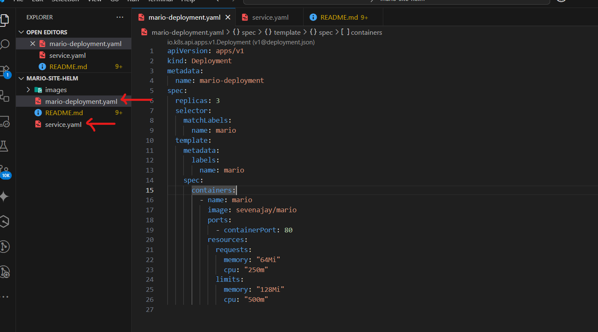

# 🎮 Mario Web App on Kubernetes (with Helm Monitoring)

This guide walks you through deploying the **`sevenajay/mario`** Docker image to your local Kubernetes cluster and adding **monitoring with Prometheus and Grafana** . This project showcases a Kubernetes deployment of a Mario-themed web application using handcrafted deployment.yaml and service.yaml files. The Docker image is pulled directly from Docker Hub.
Grafana is installed alongside the app to monitor cluster performance and application metrics, and Lens is used to visually explore the live Kubernetes environment.
This project is ideal for beginners learning Kubernetes deployment, service exposure, observability with Grafana, and visual debugging with Lens.

---

## 🧱 Prerequisites

- Docker (for Minikube)
- kubectl
- Helm
- Minikube (or other local K8s)
- Lens (optional)

```
├──mario-site-helm/
├── mario-deployment.yml
└── service.yml
```

## Project Folder Structure


---

## 📦 Step 1 – Start Minikube

- Run the following command in the terminal.

```bash
minikube start
```


---

## 📄 Step 2 – Create `mario-deployment.yaml` And `service.yaml`

- Create a file in the project directory with following details:

- Filename: `mario-deployment.yaml`
- File contents: copy and paste below yaml script

```yaml
apiVersion: apps/v1 
kind: Deployment
metadata:
  name: mario-deployment
spec:
  replicas: 3
  selector:
    matchLabels:
      name: mario
  template:
    metadata:
      labels:
        name: mario
    spec:
      containers:
        - name: mario
          image: sevenajay/mario
          ports:
            - containerPort: 80
          resources:
            requests:
              memory: "64Mi"
              cpu: "250m"
            limits:
              memory: "128Mi"
              cpu: "500m"
```

- Create another file with details:
- File name: `service.yaml`
- File contents:copy and paste below yaml script

```yaml
apiVersion: v1
kind: Service
metadata:
  name: mario-service
spec:
  type: NodePort
  selector:
    name: mario
  ports:
    - protocol: TCP
      port: 80
      targetPort: 80
      nodePort: 30080
```  



---

## ☸️ Step 3 – Deploy Mario

- In your terminal run below commands to deploy

```bash
kubectl apply -f mario-deployment.yaml
kubectl apply -f service.yaml
```  


---

## 🌍 Step 4 – Open Mario Site

- To view site. Run:

```bash
minikube service mario-service
```


- Use Ctrl+C to end transmission

---

## 📊 Step 5 – Add Monitoring with Helm

### 5.1 Add repo & update

- Run the following commands to add Helm charts monitoring. Skip if helm is alredy installed.

```bash
helm repo add prometheus-community https://prometheus-community.github.io/helm-charts
helm repo update
```


### 5.2 Install kube‑prometheus‑stack

- From there install Prometheus for monitoring by running below in your terminal:

```bash
helm install mario-monitoring prometheus-community/kube-prometheus-stack -n monitoring --create-namespace
```


### 5.3 Access Grafana

- Before port forwarding, make sure to have your grafana password. To get it:
Run

```bash
kubectl --namespace monitoring get secret mario-monitoring-grafana -o yaml
```

- From the display search for
data:
  admin-password: [password] #which is in base64

  

- Copy it and go to below link to decode
    <https://www.base64decode.org/>

  

- Access Grafana  and port forward by running:

```bash
kubectl -n monitoring port-forward svc/mario-monitoring-grafana 30000:80
```


- Go to **<http://localhost:30000>**
- Enter your username 'admin' and decoded password


### Note: Ignore if above works smoothly for you

- If its in pending mode or creating mode wait a bit for it to fully run
- Also if you have old stack confusing current monitoring stack. You can delete them by running:

```bash
helm list -A       #To view all stacks
helm uninstall <stack-name> -n <corresponding-namespace> #Repeat depending on the stacks you want to delete using the name and namespace
kubectl delete namespace <namespace-attached-name>      #To delete namespace, to be on the safer side
helm repo update
helm install mario-monitoring prometheus-community/kube-prometheus-stack -n monitoring --create-namespace   #Re-run to create mario monotoring stack.
kubectl -n monitoring port-forward svc/mario-monitoring-grafana 30000:80  #Run to forward monitoring
```


Go to **<http://localhost:30000>**  
Login `admin / decoded-password`


- On the dashboard, go to connections to add new connections(prometheus,Loki)


- Add new data source


- Go to terminal and run

```bash
kubectl get svc mario-monitoring-kube-prom-prometheus -n <namespace> -o wide #to get ip address
```


- Give it a name for the URL: it should look like `http://<CLUSTER-IP>.114:9090`


- Go to Explore to view visual of data source


**Note**
Make sure the terminal is still port forwarding. Always re-forward if connection is lost or stopped to keep grafana GUI running.

---

## 🔍 Step 6 – (Opt) Lens Visualization

Open Lens, connect to Minikube, inspect resources.

- Launch Lens Desktop App
- On the left sidebar, click “Clusters”
- You should already see your minikube cluster (or whatever name you used)
- Click Connect
- You’ll see your cluster’s dashboard (CPU, memory, nodes, etc.)
- Click on Overview for full minikube clusters


- Explore Namespaces
    On the left menu, click “Namespaces”
    Select or filter to:
    monitoring (for Grafana, Prometheus, Alertmanager)
    default or your Mario app’s namespace


-View Mario App
    Click “Workloads” > “Deployments”
    Look for mario-deployment
    Click “Services”
    Locate mario-service (NodePort 30080)
    You can click to view:
       Live pod logs
       Events
       Resource usage (CPU, memory)


- Port Forward Easily from Lens
- Instead of CLI, do this:
    Select a Network > Services > mario-service
    Click the “Port Forward” button in top-right corner
    Lens will expose the service at something like:

  


---

## 🧨 Step 7 – Teardown

- To tear down resources run below commands

```bash
kubectl delete -f mario-deployment.yaml
kubectl delete -f service.yaml
helm uninstall mario-monitoring -n monitoring
kubectl delete namespace monitoring
```


---

## Recap & Summary

- Deployed Docker Hub image on K8s
- Exposed via NodePort
- Added Prometheus + Grafana with Helm
- Clean removal steps

---

**Rashida Mohammed**  
[LinkedIn](https://www.linkedin.com/in/rashida-mohammed-cloud)
[GitHub](https://github.com/Rashkerry-newversion)

---

MIT Rashida Mohammed © 2025
